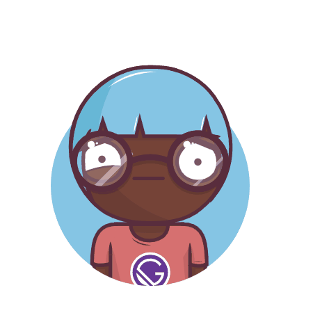

<p align="center" >
  
</p>

Easily generate avatars for your projects with Bean Heads. https://beanheads.robertbroersma.com

<a href="https://www.buymeacoffee.com/robertbroersma" target="_blank"></a>

### Try it

Navigate to [our online playground](https://beanheads.robertbroersma.com/editor)!

### Getting Started

```shell
yarn add @bigheads/core
```

or

```shell
npm install @bigheads/core --save
```

then, in your app:

```jsx
import { BigHead } from '@bigheads/core'

const Example = () => (
  <BigHead
    accessory="shades"
    body="chest"
    circleColor="blue"
    clothing="tankTop"
    clothingColor="black"
    eyebrows="angry"
    eyes="wink"
    facialHair="mediumBeard"
    graphic="vue"
    hair="short"
    hairColor="black"
    hat="none"
    hatColor="green"
    lashes="false"
    lipColor="purple"
    mask="true"
    faceMask="true"
    mouth="open"
    skinTone="brown"
  />
)
```

### Props

- [`accessory`](#accessory)
- [`body`](#body)
- [`circleColor`](#circlecolor)
- [`clothing`](#clothing)
- [`clothingColor`](#clothingcolor)
- [`eyebrows`](#eyebrows)
- [`eyes`](#eyes)
- [`facialHair`](#facialhair)
- [`graphic`](#graphic)
- [`hair`](#hair)
- [`hairColor`](#haircolor)
- [`hat`](#hat)
- [`hatColor`](#hatcolor)
- [`lashes`](#lashes)
- [`lipColor`](#lipcolor)
- [`mask`](#mask)
- [`faceMask`](#faceMask)
- [`mouth`](#mouth)
- [`skinTone`](#skinTone)

# Reference

## Props

### `accessory`

Type of accessory

| Type                                                  | Required |
| ----------------------------------------------------- | -------- |
| enum('none', 'roundGlasses', 'tinyGlasses', 'shades') | No       |

---

### `body`

Type of body

| Type                     | Required |
| ------------------------ | -------- |
| enum('chest', 'breasts') | No       |

---

### `circleColor`

The color of the circular background

| Type         | Required |
| ------------ | -------- |
| enum('blue') | No       |

---

### `clothing`

Type of cloth

| Type                                                              | Required |
| ----------------------------------------------------------------- | -------- |
| enum('naked', 'shirt', 'dressShirt', 'vneck', 'tankTop', 'dress') | No       |

---

### `clothingColor`

The color of the clothes

| Type                                           | Required |
| ---------------------------------------------- | -------- |
| enum('white', 'blue', 'black', 'green', 'red') | No       |

---

### `eyebrows`

Type of eyebrows

| Type                                                           | Required |
| -------------------------------------------------------------- | -------- |
| enum('raised', 'leftLowered', 'serious', 'angry', 'concerned') | No       |

---

### `eyes`

Type of eyes

| Type                                                                                           | Required |
| ---------------------------------------------------------------------------------------------- | -------- |
| enum('normal', 'leftTwitch', 'happy', 'content', 'squint', 'simple', 'dizzy', 'wink', 'heart') | No       |

---

### `facialHair`

Type of facial hair

| Type                                                     | Required |
| -------------------------------------------------------- | -------- |
| enum('none', 'none2', 'none3', 'stubble', 'mediumBeard') | No       |

---

### `graphic`

Type of graphic over the t-shirts

| Type                                                         | Required |
| ------------------------------------------------------------ | -------- |
| enum('none', 'redwood', 'gatsby', 'vue', 'react', 'graphQL') | No       |

---

### `hair`

Type of hair

| Type                                                                            | Required |
| ------------------------------------------------------------------------------- | -------- |
| enum('none', 'long', 'bun', 'short', 'pixie', 'balding', 'buzz', 'afro', 'bob') | No       |

---

### `hairColor`

The color of the hair

| Type                                                                | Required |
| ------------------------------------------------------------------- | -------- |
| enum('blonde', 'orange', 'black', 'white', 'brown', 'blue', 'pink') | No       |

---

### `hat`

Type of hat

| Type                                                                 | Required |
| -------------------------------------------------------------------- | -------- |
| enum('none', 'none2', 'none3', 'none4', 'none5', 'beanie', 'turban') | No       |

---

### `hatColor`

The color of the hat

| Type                                           | Required |
| ---------------------------------------------- | -------- |
| enum('white', 'blue', 'black', 'green', 'red') | No       |  |

---

### `lashes`

Show lashes

| Type                  | Required |
| --------------------- | -------- |
| enum('true', 'false') | No       |

---

### `lipColor`

The color of the lips

| Type                                               | Required |
| -------------------------------------------------- | -------- |
| enum('red', 'purple', 'pink', 'turqoise', 'green') | No       |

---

### `mask`

If set to true it displays the avatar in a circle and cuts off everything below it.
If set to false, it won't display the circle, and won't clip off any of the avatar.

| Type    | Required |
| ------- | -------- |
| boolean | No       |

---

### `faceMask`

If set to true the avatar will be wearing a face mask

| Type    | Required |
| ------- | -------- |
| boolean | No       |

---

### `mouth`

Type of mouth

| Type                                                                  | Required |
| --------------------------------------------------------------------- | -------- |
| enum('grin', 'sad', 'openSmile', 'lips', 'open', 'serious', 'tongue') | No       |

---

### `skinTone`

The color of the skin

| Type                                                     | Required |
| -------------------------------------------------------- | -------- |
| enum('light', 'yellow', 'brown', 'dark', 'red', 'black') | No       |

---

# License

I have made Bean Heads icons available for you to incorporate into your products under the MIT License. Feel free to remix and re-share for personal or commercial use. I'd love attribution, but it's not required. The only thing I ask is that you not re-sell these icons.
